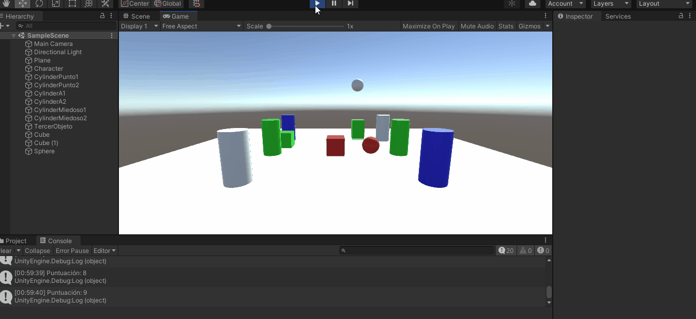

# Práctica 3 de Interfaces Inteligentes.

## **Autor**: Francisco Jesus Mendes Gomez.

## **Índice:**  

1. [**Estado Actual**](#id1)
2. [**Apartados Práctica 3**](#id2)   

<div name="id1" />

## 1. Estado actual.

Para esta práctica se ha continuado la el trabajo realizado en la práctica anterior, haciendo ligeras modificaciones en los scripts:  

+ `Character_Controller_Propia.cs` 
+ `Miedo.cs`
+ `Movement.cs`
+ `MoverFuera.cs`
+ `ScaleCilinder.cs`
+ `ScalePlusAndMinus.cs`

Y se ha añadido el script `FollowPlayer.cs` para que la cámara siga al jugador desde una perspectiva de tercera persona. Aparte de varios aspectos visuales.  
+ Anteriormente

  

+ Actualmente

  

Ver referencia a [Práctica 2 (Anterior)](https://github.com/alu0101163970/Practica_2_II2122.git) para consultar y comparar los cambios.

<div name="id2" />

## 2. Apartados Práctica 3

### Modificar la escena de la práctica anterior con los siguientes comportamientos:
+ Cuando el jugador colisiona con un objeto de tipo B, el objeto A mostrará un texto en una UI de Unity. Cuando toca el objeto A se incrementará la fuerza del objeto B.  

Para este apartado se ha creado un Controlador de las escena que se encuentra en el fichero `ControladorEscena.cs`. Para gestionar los delegados y los eventos cuando colisiona el jugador con el objeto A y con el objeto B. 
```c#
using System.Collections;
using System.Collections.Generic;
using UnityEngine;


public class ControladorEscena : MonoBehaviour
{
    public delegate void colisionConA (Vector3 direcciones);
    public delegate void colisionConB ();
    public event colisionConA colisionA;
    public event colisionConB colisionB;
    public static ControladorEscena controlador;

    private bool bCollided = false;
    private bool aCollided = false;
    private Vector3 direccionEmpuje;
    void Awake()
    {
        if(controlador == null)
        {
            controlador = this;
            DontDestroyOnLoad(this);
        }
        else if (controlador != this)
        {
            Destroy(gameObject);
        }
    }
    // Start is called before the first frame update
    private GameObject objetoB; 
    void Start()
    {
        objetoB = GameObject.Find("ObjetoTipoB");
    }

    // Update is called once per frame
    void Update()
    {
        if (bCollided)
        {
            colisionB();
            bCollided = false;
        };

        if (aCollided)
        {
            colisionA(direccionEmpuje);
            aCollided = false;
        };
    }

    public void CollisionOnA (Vector3 direcciones)
    {
        aCollided = true;
        direccionEmpuje = direcciones;
    }

    public void CollisionOnB ()
    {
        bCollided = true;
    }
}

```

También se han añadido los siguientes scripts para este propósito:

  + `SendMessageToGameControler.cs`: Para avisar al controlador que el jugador ha colisionado con el objeto B.
  + `EscribirUI.cs`: Hacer que el objeto A manipule el objeto UI text indicando cuantas vesces se ha colisionado con el objeto B.
  + `SendMessageToController2.cs`: Para avisar al controlador que el jugador ha colisionado con el objeto A.
  + `IncrementarFuerza.cs`: Para que el objeto B sea empujado a la dirección opuesta de la colision de A con el jugador y que a medida que estos colisionen más veces este empuje será más fuerte.  


Resultado:

  

Aquí el objeto A es el cubo dorado y el objto B es la capsula dorada.  


+ Cuando el jugador se aproxima a los cilindros de tipo A, los cilindros de tipo B cambian su color y las esferas se orientan hacia un objetivo ubicado en la escena con ese propósito. Consultar información de la clase Vector3: LookAt, RotateTowards, ...  


+ Implementar un controlador que mueva el objeto con wasd  


+ Buscar información de Debug.DrawRay y utilízala para depuración.  

